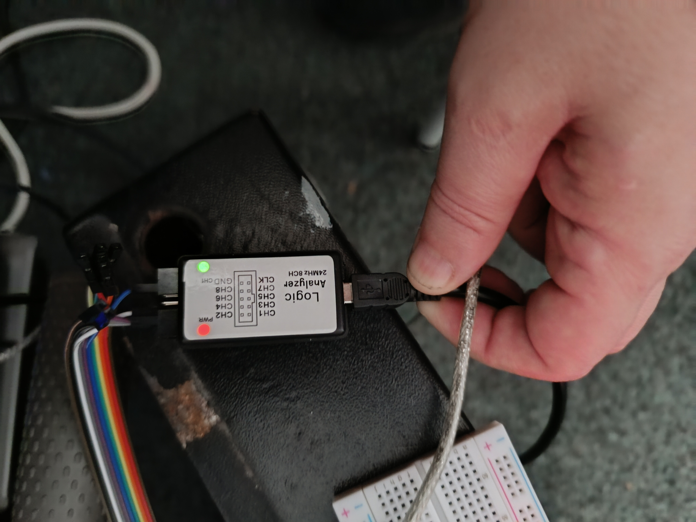
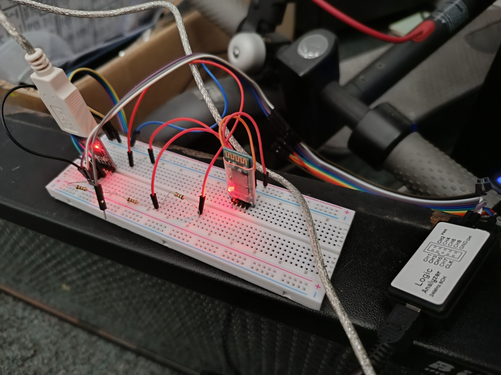
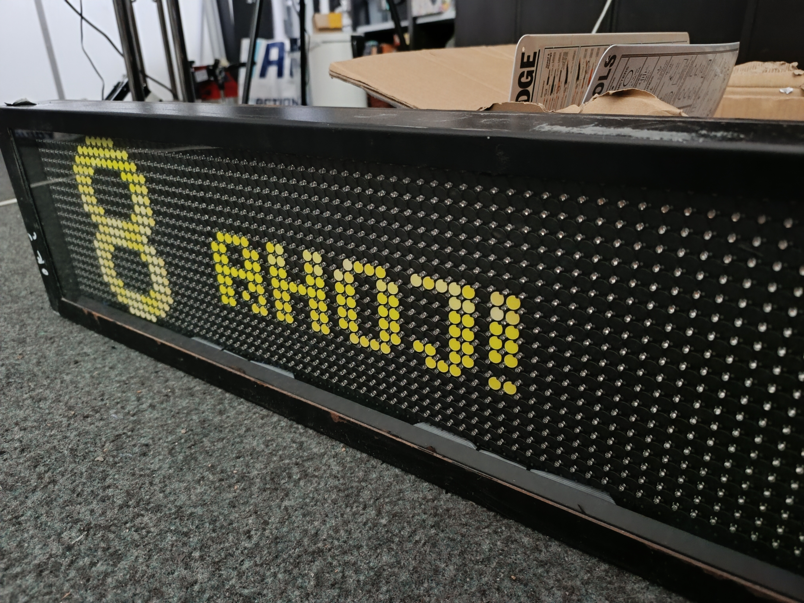
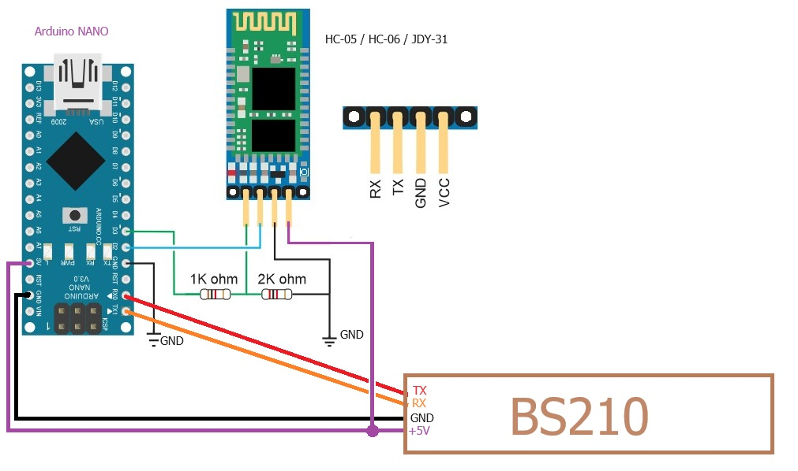

<p class="markdown-heading" dir="auto">
  
   <a href="https://android-arsenal.com/api?level=31" rel="nofollow">
   </a>
   
   
</p>

# ibis-android
Ovládání displejů dopravního systému IBIS pomocí Bluetooth v mobilní aplikaci pro Android. Zejména pak ovládání displejů DOT-LED, MATRIX, FLIP-FLOP apod. Například BS210. Pomocí této aplikace lze provést změnu čísla Linky, zastávky, zobrazit vlastní texty apod.

Beta verze ke stažení zde: https://github.com/soptikopava/ibis-android/releases/tag/v1.0.0-beta

Aplikace podporuje světlé i tmavé téma. Minimální verze Android je verze 12.
Screenshot aktuální verze aplikace:


<div>


</div>

# Začínáme
Zde se pokus popsat co nejpodrobněji celý projekt tak, abyste si jej mohli postavit taky. Popíšu ho včetně postupu, jak jsem na některé věci přišel.

## Požadavky
### Software 
Pro instalaci aplikace potřebujete zařízení se systémem Android verze 12 nebo vyšší. Dobře poslouží jak tablet, tak mobil. Zařízení musí mít zapnuté Bluetooth. Komunikace s Bluetooth zahrnuje také váš souhlas ke zjišťování pozice. Toto je dáno požadavky Androidu. Android jsem zvolil, protože mi chyběla právě tato taková aplikace. Programů pro Windows je více, například německý IBISUtil nebo český BSLoader. Nepřišlo mi však praktické, abych kvůli každému nápisu musel rozbalovat a zapojovat svůj notebook. Mobil mám u sebe nejčastěji.
### Hardware
* Samozřejmě je to displej, který potřebujeme. V mém případě se jedná o displej BS210, který jsem zakoupil od kamaráda. Nejsem nadšenec do dopravy. Spíše jsem viděl příležitost si vyrobit něco geekovského, co nemá každý 😎
* Bluetooth modul HC-06 nebo HC-05 (Já jsem použil HC-06.)
* Displej je napájený zdrojem =24V, takže zdroj 24V/2A
* Protože bluetooth modul používá logiku 3.3V a displej 5V, potřebujeme rezistory buď 3 kusy 10 kOhm, nebo 1 kus 10 kOhm + 1 kus 20 kOhm. Prostě takové, co najdete v šuplíku nejčastěji. Pomocí rezistorů vytvoříme dělič napětí a přizpůsobíme tak použitou logiku na správnou hodnotu.
(Zde obrázek zapojení rezistorů jako dělič napětí.)
## Popis software
V aplikaci lze vybrat Bluetooth zařízení, na které je pak možné poslat datovou větu (tzv. payload). Ten se tvoří z příkazu IBIS. Payload pak obsahuje na předposledním pozici symbol pro návratový vozík `CR` a kontrolní součet.
Stiskem tlačítka `Odeslat na displej` se otevře sériová komunikace pomocí Bluetooth s displejem a payload se odešle přímo do sběrnice - v našem případě pomocí TTL přímo na piny procesoru.

## Popis hardware
Dovolte mi trochu zabrousit do popisu, jak jsem na to přišel.
### Díl 1. - Minulost ve znamení TTL
Abych zjistil, jak komunikace funguje, byl mi doporučen převodník z RS232 na IBIS, který používá 24V logiku HTL. HTL používá vždy dva signálové vodiče, kde každý z nich má vlastní oddělenou zem. Protože RS232 má obráceno logiku, proto musí mít převodník na HTL invertor, který obrací logickou  a převodník 1 na 0 a 0 na 1. Přišlo mi to až moc komplikované pro můj projekt. Proto jsem se rozhodl, že základní desku displeje prozkoumám podobněji. Zjistil jsem, že vstupy ze svorkovnice IBIS vedou na dělící člen, asi optočlen, který převádí 24V na nižší napětí a zároveň chrání další součástky proti přepětí. Bylo tedy jasné, že nejpravděpodobněji do procesoru bude přivedena logika TTL. S multimetrem jsem si ověřil, že se jedná o 5V logiku. Další součástka před procesorem je Schmittův obvod 74HC14D. Tento obvod zvyšuje napětí z dělících členů na logické úrovně 0V a 5V. Zároveň se snaží odstranit drobné rušení na vedení a skládá signál tak, aby měly logické 0 a 1 ostrou hranu a šly lépe rozpoznat. Při měření jsem našel na základní desce měřící body. Tyto body používají servisní technici, aby odhalili příčinu závady, když se jim na stůl dostane vadná deska. Využít tyto měřící body bylo více než příhodné. Vyhrabal jsem ze šuplíku převodník z USB na TTL Prolific PL2303 v ceně cca 35 Kč. A ejhle, fungovalo to jak s programem IBISUtil tak BSLoader.

Ukázka TTL sběrnice displeje BS210 a komunikační LED, které signalizují tok dat Rx, Tx aj.

<p> </p>
Ukázka zapojení použitého převodníku TTL na USB přímo do PC:


Cílem tohoto projektu však není připojit displej k USB počítače bez složitých převodníků a kabelů. Cílem je ovládat displej bezdrátově skrze bluetooth v mobilu nebo tabletu.
### Díl 2. - Minulost ve znamení komunikace
Probram IBISUtils i BSLoader s TTL převodníkem fungoval bezchybně. Další fáze tedy byla zapojení samotného bluetooth modulu. Měla to být nejsnadnější fáze, ale nebyla. Modul sice data z mobilu přijímal, ale displej byl hluchý, prostě nereagoval.
Standartní komunikace na TTL linkách u pomalejších čipů bývá 9600 bit/s, U rychlejších pak třeba 115200 bit/s. Vyzkoušel jsem všechny rychlosti a nic. Nezbylo nic jiného, než ze šuplíku oprášit starý analyzátor a odposlechnout komunikaci s použitím opět převodníku USB na TTL. Jak je vidět na jednom z obrázku, ukázalo se, že displej komunikuje pouze s tímto nastavení sériového portu `1200 bit/s,7 bitů, sudá parita, 2 stop byty`. 

Ukázka z IBISUtils a nastavení odeslání vlastního textu na displej:


Můj logický analyzér:


Zapojení logického analyzátoru komunikace TTL v nepájivém poli (na fotce je vidět i dělič napětí pro bluetooth modul sestavený z 3x 10kOhm):


Zobrazený text na displeji BS210:


Odposlech komunikace z aplikace IBISUtils v ASCII:

* První řádek s nastavením 1200,8,N,1

* Druhý řádek s nastavením 1200,7,N,1

* Třetí řádek s nastavením 1200,7,N,2

Odposlech komunikace z aplikace IBISUtils v HEX:


Aby bluetooth modul HC-06 uměl s diplejem komunikovat, je třeba jej správně nastavit. Tento modul má celkem jednoduché nastavení, které se provádí pomocí AT příkazů.
Na internetu existuje opravdu hodně ukázek, jak mobul HC-06 nebo HC-05 zapojit k Arduinu nebo TTL převodníku. Nechci zde suplovat aktualizované návody a tak uvádím jen příkazy.
Pomocí převodníku USB na TTL jsem provedl nastavení těmito příkazy:
```
AT+NAME=BS210-moje (nastavení názvu blouetooth zařízení)
AT+PSWD=1111       (nastavení PINu pro spárování s mobilem)
AT+UART=1200,0,0   (nastavené rychlosti portu, stop byt a parity)
```
Některé verze firmware reagují na tyto příkazy:
```
AT+NAME=BS210-moje (nastavení názvu blouetooth zařízení)
AT+PSWD=1111       (nastavení PINu pro spárování s mobilem)
AT+BAUD1           (nastavené rychlosti portu na 1200 bit/s)
```
Ověření údajů nastavení lze provést tímto příkazem, který vypíše aktuální nastavení:
```
AT+UART?
```
> [!CAUTION]
> V šuplíku jsem našel celkem tři bluetooth moduly: HC-05, HC-06 a JDY-31. Jak se však ukázalo, ani jeden neumí nastavit komunikaci na 2 stop byty. Modul HC-06 a JDY-31 navíc neumožňují komunikaci tak pomalou, jako je tolik potřebných 1200 bitů/s. Samotné moduly tedy lze použít jen s dalším doplňkem. Nyní jsem měl dvě možnosti: zakoupit něco jako Arduino s integrovaným BT modulem na desce, nebo použít staré Arduino UNO, které jsem měl v šuplíku. Rozhodl jsem se pro staré Arduino UNO, abych zbytečně neutrácel peníze a svému šuplíku i peněžence ulevil. Pokud musíte něco koupit, přidejte si do košíku raději Arduino s BT modulem v sobě.

Úloha Arduina je převádět komunikaci z bluetooth modulu s nastavením 1200,8,N,0 na potřebnou 1200,7,E,2. Schéma zapojení vodičů:


Pro Arduino UNO jsem použil tento primitivní kód:
```
#include <SoftwareSerial.h>

SoftwareSerial EEBlue(2, 3); // RX | TX

void setup() {
  Serial.begin(1200, SERIAL_7E2); // Nastaví sériovou komunikaci s rychlost 1200 b/s, 7 datovými bity, sudou paritou a 2 stop bity
  EEBlue.begin(1200); // Nastaví komunikaci s Bluetooth modulem na rychlost 1200 b/s
}

void loop() {
  // Přenáší data z Bluetooth modulu do terminálu
  if (EEBlue.available()) {
    Serial.write(EEBlue.read());
  }

  // Přenáší data z terminálu do Bluetooth modulu
  if (Serial.available()) {
    EEBlue.write(Serial.read());
  }
}
```

### Současnost
Pro úpravu displeje BS210 jsem použil bezdrátový modul HC-06, který je modernější verzi staré HC-05, viz obr. vlevo. Bezdrátové moduly používají většinou 3.3V logiku. K dipleji lze také připojit obyčejný TTL USB převodník s čipem Prolific 2303 nebo CH340, viz obr. vpravo. Tyto převodníky používají 5V logiku. S tímto převodníkem můžeme připojit displej přímo USB kabelem do PC, aniž bychom potřebovali další součástky. Je to nejsnadnější cesta jak komunikovat s displejem v kombinaci s programem BSLoader.exe nebo IBISUtils.

<p> </p>
  Ukázka zapojení HC-06 k displeji:
  

<p> </p>
Ukázka připojení bezdrátového modulu přímo na TTL sběrnici k procesoru displeje BS210:


Takto by to jednou mohlo vypadat:
 Zdroj obrázku: internet

