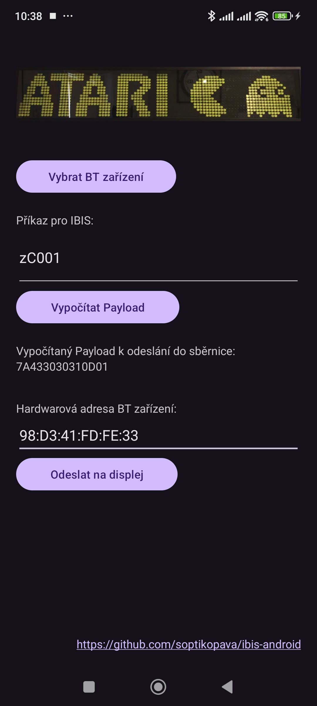

  
   
   
   

# ibis-android
Ovl치d치n칤 displej콢 dopravn칤ho syst칠mu IBIS pomoc칤 Bluetooth v mobiln칤 aplikaci pro Android. Zejm칠na pak ovl치d치n칤 displej콢 DOT-LED, MATRIX, FLIP-FLOP apod. Nap콏칤klad BS210. Pomoc칤 t칠to aplikace lze prov칠st zm캩nu 캜칤sla Linky, zast치vky, zobrazit vlastn칤 texty apod.

Beta verze ke sta쬰n칤 zde: https://github.com/soptikopava/ibis-android/releases/tag/v1.0.0-beta

Aplikace podporuje sv캩tl칠 i tmav칠 t칠ma. Minim치ln칤 verze Android je verze 12.
Screenshot aktu치ln칤 verze aplikace:

# Za캜칤n치me
Zde se pokus popsat co nejpodrobn캩ji cel칳 projek tak, abyste si jej mohli postavit taky. Pop칤코u ho v캜etn캩 postupu, jak jsem na n캩kter칠 v캩ci p콏i코el.

## Po쬬davky
### Software 
Pro instalaci aplikace pot콏ebujete za콏칤zen칤 se syst칠mem Android verze 12 nebo vy코코칤. Dob콏e poslou쮂 jak tablet, tak mobil. Za콏칤zen칤 mus칤 m칤t zanut칠 Bluetooth. Komunikace s Bluetooth zahrnuje tak칠 v치코 souhlas ke zji코tov치n칤 pozice. Toto je d치no po쬬davky Androidu. Android jsem zvolil, proto쬰 mi chyb캩la pr치v캩 tato takov치 aplikace. Program콢 pro Windows je v칤ce, nap콏칤klad n캩meck칳 IBISUtil nebo 캜esk칳 BSLoader. Nep콏i코lo mi v코ak praktick칠, abych kv콢li ka쬯칠mu n치pisu musel rozbalovat a zapojovat sv콢j notebook. Mobil m치m u sebe nej캜ast캩ji.
### Hardware
* Samoz콏ejm캩 je to displej, kter칳 pot콏ebujeme. V m칠m p콏칤pad캩 se jedn치 o displej BS210, kter칳 jsem zakoupil od kamar치da. Nejsem nad코enec do dopravy. Sp칤코e jsem vid캩l p콏칤le쬴tost si vyrobit n캩co geekovsk칠ho, co nem치 ka쬯칳 游땙
* Bluetooth modul HC-06 nebo HC-05 (J치 jsem pou쬴l HC-06.)
* Displej je nap치jen칳 zdrojem =24V, tak쬰 diplej 24V/2A
* Proto쬰 bluetooth modul pou쮂셨치 logiku 3.3V a displej 5V, pot콏ebujeme rezistory bu캞 3 kusy 10 kOhm, nebo 1 kus 10 kOhm + 1 kus 20 kOhm. Prost캩 takov칠, co najdete v 코upl칤ku nej캜ast캩ji. Pomoc칤 rezistor콢 vytvo콏칤me d캩li캜 nap캩t칤 a p콏izp콢sob칤me tak pou쬴tou logiku na spr치vnou hodnotu.
(Zde obr치zek zapojen칤 rezisor콢 jako d캩li캜 nap캩t칤.)
## Popis software
V aplikaci lze vybrat Bluetooth za콏칤zen칤, na kter칠 je pak mo쬹칠 poslat datovou v캩tu (tzv. payload). Ten se tvo콏칤 z p콏칤kazu IBIS. Payload pak obsahuje na p콏edposledn칤m pozici symbol pro n치vratov칳 voz칤k "CR" a kontroln칤 sou캜et.
Stiskem tla캜칤tka `Ode코lat na displej` se otev콏e s칠riov치 komunikace pomoc칤 Bluetooth s displejem a payload se ode코le p콏칤mo do sb캩rnice - v na코em p콏칤pad캩 pomoc칤 TTL p콏칤mo na piny procesoru.

## Popis hardware
### Minulost
Abych zjistitl, jak komunikace funguje, byl mi doporu캜en p콏evodn칤k z RS232 na IBIS, kter칳 pou쮂몄칤 24V logiku HTL. HTL pou쮂셨치 v쬯y dva sign치lov칠 vodi캜e, kde ka쬯칳 z nich m치 vlastn칤 odd캩llenou zem. Proto쬰 RS232 m치 obr치ceno logiku, proto mus칤 m칤t p콏evodn칤k na HTL invertor, kter칳 obrac칤 logickou  a p콏evodn칤k 1 na 0 a 0 na 1. P콏i코lo mi to a moc komplikovan칠 pro m콢j projekt. Proto jsem se rozhodl, 쬰 z치kladn칤 desku displeje prozkoum치m podobn캩ji. Zjistil jsem, 쬰 vstupy ze svorkovnice IBIS vedou na d캩l칤c칤 캜len, asi opto캜len, kter칳 p콏ev치d칤 24V na ni쮄뫆 nap캩t칤 a z치rove켿 chr치n칤 I/O procesoru proti p콏ep캩t칤. Bylo tedy jasn칠, 쬰 nejpravd캩podobn캩ji do procesoru bude p콏ivedena logika TTL. S multimetrem jsem si ov캩콏il, 쬰 se jedn치 o 5V logiku. Dal코칤 sou캜치stka p콏ed procesorem je klopn칳 obvod 74HC74. JEdn치 se klopn칳 obvod, kter칳 je zapojen jako invertor logick칳ch hodnot a p콏치v캩 p콏ev치d칤 logickou 1 na 0 a logickou 0 na 1. P콏ev치d칤 tak b캩쬹ou komunikaci RS232 na TTL. T칤mto skl치n칤m poctu v칳voj치콏칤m - je to chytr칠 a jednoduch칠 콏e코en칤. P콏i m캩콏en칤 jsem na코el na z치kadn칤 desce m캩콏칤c칤 body. Tyto body pou쮂셨aj칤 servisn칤 technici, aby odhalili p콏칤캜inu z치vady, kdy se jim na st콢l dostane vadn치 deska. Vyu쮂셦 tyto m캩콏칤c칤 body bylo v칤ce ne p콏칤hodn칠. Vyhrabal jsem ze 코upl칤ku p콏evodn칤k z USB na TTL Prolific PL2303 v cen캩 cca 35 K캜. A ejhle, fungovalo to jak s programem IBISUtil tak BSLoader.

C칤lem tohoto projektu v코ak nen칤 p콏ipojit displej k USB po캜칤ta캜e bez slo쬴t칳ch p콏evodn칤k콢 a kabel콢. C칤lem je ovl치dat displej bezdr치tov캩 skrze blouetooth v mobilu nebo tabletu.

 

Uk치zka zapojen칤 pou쮂셦칠ho p콏evodn칤ku TTL na USB p콏칤mo do PC:

### Sou캜astnost
Pro 칰pravu displeje BS210 jsem pou쬴l bezdr치tov칳 modul HC-06, kter칳 je modern캩j코칤 verzi star칠 HC-05, viz obr. vlevo. Bezdr치tov칠 moduly pou쮂셨aj칤 v캩t캜inou 3.3V logiku. K dipleji lze tak칠 p콏ipojit oby캜ejn칳 TTL USB p콏evodn칤k s 캜ipem Prolific 2303 nebo CH340, viz obr. vpravo. Tyto p콏evodn칤ky pou쮂셨aj칤 5V logiku. S t칤mto p콏evodn칤kem m콢쬰me p콏ipojit displej p콏칤mo USB kabelem do PC, ani bychom pot콏ebovali dal코칤 sou캜치stky. Je to nejsnadn캩j코칤 cesta jak komunikovat s displejem v kombinaci s programem BSLoader.exe

 

  Uk치zaka zapojen칤 HC-06 k displeji:
  

 

Uk치zka p콏ipojen칤 bezdr치tov칠ho modulu p콏칤mo na TTL sb캩rnici k procesoru displeje BS210:

Uk치zka TTL sb캩rnice displeje BS210 a komunika캜n칤 LED, kter칠 signalizuj칤 tok dat Rx, Tx aj.

Takto by to jednou mohlo vypadat:
 Zdroj obr치zku: internet

