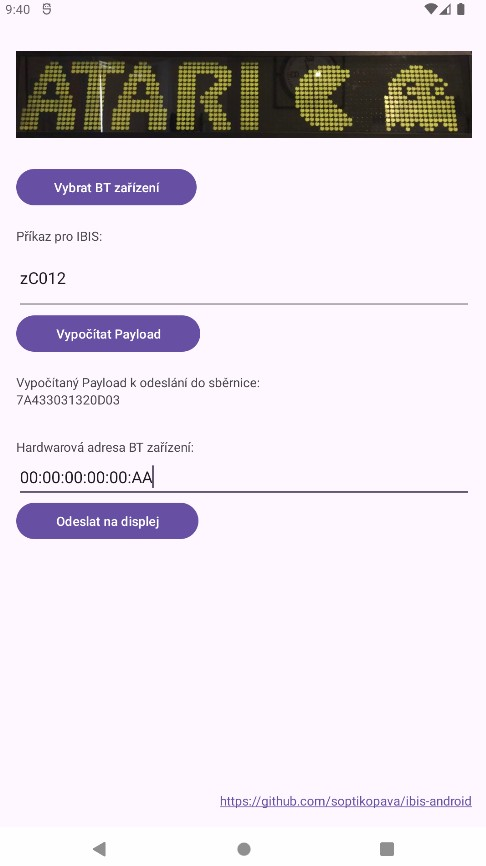

    
   
    
  

# ibis-android
Ovládání displejů dopravního systému IBIS pomocí Bluetooth v mobilní aplikaci pro Android. Zejména pak displeje DOT-LED, MATRIX, FLIP-FLOP apod. Například BS210. Lze provést změnu čísla Linky, zastávky, vlastní texty apod.

Beta verze ke stažení zde: https://github.com/soptikopava/ibis-android/releases/tag/v1.0.0-beta

Aplikace podporuje světlé i tmavé téma. Minimální verze Android je verze 12. Screenshot aktuální verze aplikace:

V aplikaci lze vybrat Bluetooth zařízení, na které je pak možné poslat datovou větu (tzv. payload). Ten se tvoří z příkazu IBIS. Payload pak obsahuje na předposledním pozici symbol pro návratový vozík "CR" a kontrolní součet.
Stiskem tlačítka Odešli na displej se otevře sériová komunikace pomocí Bluetooth a payload se odešle přímo do sběrnice - v našem případě pomocí TTL přímo na piny procesoru.
Pro úpravu displeje BS210 jsem použil bezdrátový modul HC-06, který je modernější verzi staré HC-05, viz obr. vlevo. Bezdrátové moduly používají větčinou 3.3V logiku. K dipleji lze také připojit obyčejný TTL USB převodník s čipem Prolific 2303 nebo CH340, viz obr. vpravo. Tyto převodníky používají 5V logiku. S tímto převodníkem můžeme připojit displej přímo USB kabelem do PC, aniž bychom potřebovali další součástky. Je to nejsnadnější cesta jak komunikovat s displejem v kombinaci s programem BSLoader.exe

Ukázka připojení bezdrátového modulu přímo na TTL sběrnici k procesoru displeje BS210:

Ukázka TTL sběrnice displeje BS210 a komunikační LED, které signalizují tok dat Rx, Tx aj.

Takto by to jednou mohlo vypadat:
 Zdroj obrázku: internet

